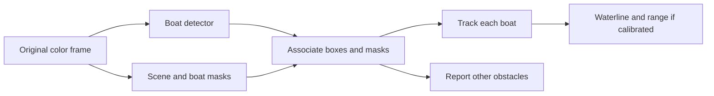

# Boat and background separation

Prepared on 2026-09-14. This is an experiment plan, not a trained segmentation model.

Existing manual boat boxes and reviewed background frames are already suitable
for detector training. Segmentation masks are an optional additional experiment,
not a prerequisite for using those annotations. First reconcile the rig's source
annotations with the local training export; see [manual-data review](MANUAL_DATA_REVIEW_20260914.md).

## Output and annotation contract

Keep the original color frame and add two kinds of labels:

| Layer | Labels | Rule |
| --- | --- | --- |
| Boat instances | One mask and identity per visible target boat | Include visible hull, superstructure and mast; exclude wake, shadow and reflected hull. Derive the detection box from the same mask. |
| Scene | Water, sky, other obstacle, ignore | Mark shore, pier and fixed structures as obstacles; leave uncertain/occluded pixels ignored. Preserve boat instances separately. |
| Review attributes | Glare, occlusion, small target, low light, own deck | Attributes for analysis, not an instruction to delete bright pixels. |

The current adapter keeps water/obstacle/sky in `SegmentationResult.mask` and
boat instances combined in `extra_masks['boat']`. Tracking still obtains vessel
identity from the detector. Do not call a generic obstacle mask a boat mask.
Use explicit mapping at import: this repository uses water=0, obstacle=1, sky=2;
external datasets may use a different order.

## Data preparation

1. Reuse the existing manually annotated color frames from the local datasets and
   the rig. Confirm which annotation version and recording each frame belongs to.
   Collect additional full color recordings only for uncovered conditions, including target boats on water,
   empty water, glare, shore, other boats crossing, partial occlusion and the own
   deck. Include near/small and moving targets under different lighting.
2. Reserve whole capture sessions and adjacent recording groups before any
   annotation, mining or training. A different frame from the same scene is not
   independent evaluation. Keep the existing 704-frame diagnostic set frozen.
3. Select an initial review batch of about 300–500 diverse frames across sessions.
   This is a pilot annotation budget, not a claim that it is sufficient to train
   a production model. Include every visible target, not only the largest one.
4. Create masks/polygons under a separate segmentation dataset root. Existing
   five-field YOLO box labels are not segmentation labels. Do not silently turn
   boxes into exact hull masks. Review any machine-assisted polygon suggestions.
5. Keep a separate reviewed background list: truly empty-water frames and hard
   negatives such as reflections, waves and the own deck. A frame containing a
   target stays positive even when a candidate detection points at a reflection.
6. Resolve conflicting annotation versions on matched frames before retraining;
   do not require the whole manually labeled dataset to be annotated again. Masks make the
   convention explicit; derive boxes from masks so both evaluations agree.

The two current rig snapshots show an indoor wall and rig parts. They are useful
for checking the input and reviewing background behavior, but they do not cover
the on-water task. No masks or negative ground truth were invented for them.

## Controlled comparison

Compare the following on identical reviewed recordings with frozen thresholds:

| Experiment | Change | Measurements |
| --- | --- | --- |
| A | Existing detector + tracker | Precision, recall, F1; FP on empty frames; per-session results |
| B | Detector retrained with reviewed background negatives and consistent boxes | Same metrics, especially glare FP and small-target recall |
| C | B plus segmentation fusion | Same detector metrics; boat/water/sky mask IoU; waterline pixel error; ID switches and track fragmentation |

For every experiment measure p50/p95 latency and end-to-end throughput on the
actual Jetson under the same resolution, power mode, camera settings and thermal
conditions. Decoder-only timing or CPU results on the Mac cannot stand in for
that measurement. Range MAE/RMSE needs independent distance measurements; the
four-point calibration fit residual is not an accuracy test.

Keep full-frame detection as the baseline. Segmentation initially adds masks,
water-contact estimates and disagreement flags. Evaluate any confidence changes
separately; do not erase the background or hard-reject a target merely because
the mask disagrees. The existing fusion can lower confidence, so its influence
on missed targets must be measured as well as its false-positive reduction.

Do not promote C based on attractive masks or training accuracy. It needs
consistent improvement on reserved sessions without losing target recall in a
critical condition, and measured latency within the rig's budget. Numerical
acceptance limits for misses, false alarms, range and latency remain to be set
for the operating scenario.

## Implementation readiness and sources

`boatdet/segmentation.py`, `fusion.py` and `pipeline.py` already provide the
optional branch. No maritime segmentation weights ship with the project.
`train.py` currently holds detection presets; it does not create a segmentation
dataset or train scene masks. This audit fixed native mask geometry by requesting
`retina_masks=True`, so letterbox padding is removed before masks are mapped to
the working frame. The integration has regression tests, not validation of
segmentation accuracy.

Ultralytics describes instance-mask polygon labels in its
[segmentation dataset format](https://docs.ultralytics.com/datasets/segment/).
For a maritime scene-model candidate, the primary
[WaSR implementation](https://github.com/lojzezust/WaSR) provides water/obstacle/sky
segmentation; it would require its own backend adapter and evaluation on these
rigs. The [LaRS evaluator](https://github.com/lojzezust/lars_evaluator) distinguishes
maritime semantic and instance evaluation. These are reference options, not
models installed or selected by this audit.
